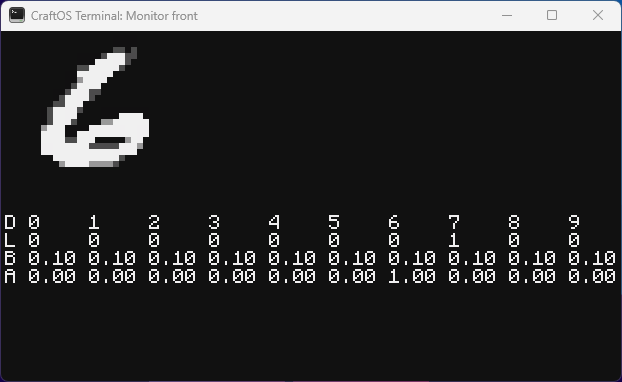
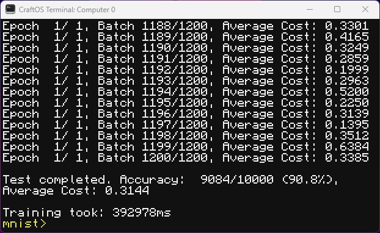

# Computercraft ML library adapted from C

All of the ML-related code is based on Magicalbat's [**youtube**](https://www.youtube.com/watch?v=hL_n_GljC0I) video. Please go watch it, he's absolutely cracked. Here's the corresponding [**GitHub repository**](https://github.com/Magicalbat/videos/tree/main/machine-learning). The MNIST dataset I've used is found [**here**](https://www.kaggle.com/datasets/oddrationale/mnist-in-csv/data).

> [!WARNING]
> Compared to the C version, the matrix math is hilariously slow. Use of **CraftOS-PC Accelerated (i.e. LuaJIT)** is highly advised.

Explanation of the 4 rows:
- D is what digit it is.
- L id what digit it is, but one-hot encoded. It lines up with D (column-wise).
- B is what the model predicts before the training.
- A is what the model predicts after the training.

The training took ~7 minutes on regular CraftOS. With CraftOS-PC Accelerated, it takes ~20 seconds. LuaJIT is amazing.

### TODO
- [x] Finish the damn thing
- [ ] Fix the bugs and clean up
- [ ] Save state to disk at every epoch
- [ ] Enable state loading
- [ ] Test the performance of pregenerating hard-coded matrix math functions for specific sizes and save it to disk to re-use
- [ ] Optimise more
- [ ] Make it work with CraftOS/inside Minecraft (yield-spam)