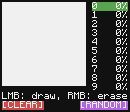
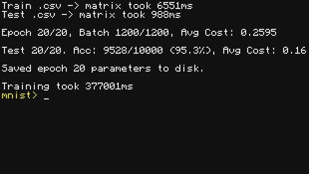

# ComputerCraft ML library adapted from C

All of the ML-related code is based on Magicalbat's [**youtube**](https://www.youtube.com/watch?v=hL_n_GljC0I) video. Please go watch it, he's absolutely cracked. Here's the corresponding [**GitHub repository**](https://github.com/Magicalbat/videos/tree/main/machine-learning). The MNIST dataset I've used is found [**here**](https://www.kaggle.com/datasets/oddrationale/mnist-in-csv/data).

> [!WARNING]
> Compared to the C version, the matrix math is hilariously slow. Use of **CraftOS-PC Accelerated (i.e. LuaJIT)** is highly advised.

1 epoch took ~7 minutes on regular CraftOS. With CraftOS-PC Accelerated, it takes ~20 seconds. LuaJIT is amazing.

### Regarding performance (or lack thereof)

Many questionable design choices were made during adaptation. One of which is not making the matrix module perform calculations in-place like the C version. The reason is that I wanted to make the module more usable for my other (non-ML) projects. In hindsight, this is kinda stupid since half of the code is very specific anyway. Oh well...

### TODO
- [x] Finish the damn thing
- [x] Fix the bugs
- [x] Save/load weights to disk
- [x] Command line args
- [ ] Test the performance of pregenerating hard-coded matrix math functions for specific sizes and save it to disk to re-use
- [ ] Optimise more
  - [ ] Ditch the auto_yielder; use in-line calls instead.
- [x] Make it work with CraftOS
- [ ] Make it work inside Minecraft (yield-spam pt.2)
- [x] Interactive demo
